# MiSTer - Gamepad Config Manager (GCM)

 Manage, save and load multiple gamepad/controller configurations per 'MiSTer FPGA' 'CORE'.  

## Installation

 To install the script, simply copy it to the 'Scripts' folder of your 'MiSTer FPGA'.  
 
 To run it, access the Scripts menu and click on 'gamepad-config-manager'.  

 On the first run, the 'gcm' directory will be created inside the 'config/inputs' folder.  

 All files required for the script to function will be placed in this folder and will be  
created automatically on the first run and during the use of the program.  

## How to use

         *** GCM - Gamepad Config Manager ***  @MM 2025.12.25

         **This help can be accessed directly at:**
            'config/inputs/gcm/data/HELP_en.txt'.

                           --- x ---

                     **1) MiSTer Files**

 In MiSTer, the gamepad configuration files are located  
in the 'config/inputs' folder. When you connect the gamepad  
via USB, Bluetooth or 2.4g and configure it, a file is generated.  
This file has the prefix 'input', followed by a unique gamepad  
identifier (e.g., 1234_abcd), the suffix 'v3' for configurations  
made in the "Define joystick buttons" menu, or 'jk' if made in the  
"Button/Key remap" menu, and the extension ".map".  
 Example:

 1) input_1234_abcd-v3.map  
 2) Intellivision_input_1234_abcd_v3.map  
 3) MSX_input_123_abcd_jk.map  

 `**File 1**`  
 Configuration made in MiSTer in 'Define joystick buttons':  

 input - file prefix  
 1234_abcd - gamepad ID  
 v3 - button configuration  
 .map - extension  

`**File 2**`  
 Configuration made in the Core 'Intellivision' menu in  
'Define Intellivision buttons':  
The only difference is the 'Intellivision' Core name as prefix  
followed by input_1234_abcd-v3.map. The suffix 'v3' indicates it's  
a configuration for 'gamepad buttons'.  

 `**File 3**`  
 Configuration made in the Core 'MSX' menu in 'Button/Key remap':  
In this case, the prefix will be 'MSX' and the suffix will be 'jk',  
indicating it's a 'keyboard configuration for the gamepad buttons'.  

                           --- x ---

                     **2) The 'GCM' Script**

 In the script, we use the term gamepad to refer to the gamepads  
connected to MiSTer.  

 MiSTer only saves one configuration per gamepad model  
in each 'CORE'. The 'GCM' script allows you to save these  
configurations in 'SLOTS', which can be loaded later on.  
For each gamepad registered in the script, we can associate multiple  
'CORES' with as many different gamepad configurations as needed.  
Each configuration is saved in a numbered 'SLOT' that can be loaded  
later on. It works like a 'SAVE STATE', but what will be saved  
is the gamepad configuration for a specific 'CORE', which can be  
the 'gamepad buttons' configuration (v3) and/or the 'keyboard mapping  
for the gamepad buttons' (jk).  

 Steps:  
 1) Configure a gamepad in MiSTer in 'Define joystick buttons'.  

 2) Still in MiSTer, configure this same gamepad in the 'CORE'  
menu. For example, for 'Intellivision', click on  
'Define Intellivision buttons'.  

 3) Open this 'GCM' script.  

 4) In the script, click on 'GAMEPADS' and 'REGISTER'.  
Register the gamepad!  

 5) In the initial 'MENU', click on "ADD - Add 'CORE'".  
Select or type the name of the 'CORE', in this case, 'Intellivision'. 

 6) Now with the 'CORE' added to the 'MENU', click on 'Intellivision'.  

 7) In the 'CORE Menu', click on 'SAVE CONFIG - CORE => SLOT'.  
The current configuration for gamepad 1234_abcd for  
'CORE Intellivision'will be saved in 'SLOT 1'. This saved  
configuration in the 'SLOT' has 2 files that can be edited   
and help in identifying it. Editing these files is not mandatory!  

 a) The first is the 'GAMES - Game List' where we list the  
games that use the configuration of 'SLOT 1'. We can edit this file  
by placing each game name on a separate line. Example:  

`  Burgertime`  
`  Bump'n'Jump`  

 b) The second is the 'LAYOUTS - Button Map', where we specify the  
relationship between the buttons on our gamepad and the controls in  
the 'CORE'. The 'Intellivision' has, in addition to the directional  
pad and action buttons, a numeric keypad.  

The first line is the default reference, the second line  
can be edited with the button configuration:  

`  ← ↓ ↑ → A B C X Y Z L R L2 R2 L3 R3 STR SEL ------ Others -------`  
`  ← ↓ ↑ → L U R 3 4 5 1 2             ENT CLR ACTION BUTTONS: L U R`  

 8) In MiSTer, we can reconfigure our gamepad for another game  
that requires a different button layout. Just repeat "STEP 7", and  
you'll have another configuration saved in a new 'SLOT'.  

 We can view the 'Game Lists' and 'Button Maps' in the  
'GAMES' and 'LAYOUT' menus. Example for '3 SLOTS' of  
'Intellivision':  

 a) 'MENU' / 'GAMES':  

 The list is organized alphabetically, with games and their  
respective 'SLOTS', all created by the script:  

`  Atlantis - 3`  
`  Bump'n'Jump - 1`  
`  Burgertime - 1`  
`  Tron - 2`  

 b) 'MENU' / 'LAYOUTS':  

` Lyts ← ↓ ↑ → A B C X Y Z L R L2 R2 L3 R3 STR SEL        Others        `  
` ---- ------------------------------------------- --------------------- `  
` 1)  ← ↓ ↑ → L U R 3 4 5 1 2             ENT CLR ACTION BUTTONS: L U R`  
` 2)  ← ↓ ↑ → 7 8 9 1 2 3 4 6              5  CLR  NO ACTION BUTTONS`  
` 3)  ← ↓ ↑ → U 0 R 4 5 6 7 9              1   3  ACTION BUTTONS: U R`  

 Note that the 'Game List' and 'Button Map' indicate the  
'SLOT', making the next STEP easier.  

 - Example: 'CORE' Apple-II - 'Button/Key remap' - Game Load Runner:  

 a) 'MENU' / 'GAMES':  
 
`  Load Runner - 1`  

 b) 'MENU' / 'LAYOUTS':  
 
` Lyts ← ↓ ↑ → A B C X Y Z L R L2 R2 L3 R3 STR SEL        Others`  
` ---- ------------------------------------------- ---------------------`  
`  1)  J K I L U O                         CTL        CTL+k=keyboard`  

 9) 'MENU' / 'LOAD' - Just click 'LOAD - SLOT => CORE' and choose  
a 'SLOT' to load the saved configuration and overwrite the 'CORE'  
configuration. The only file on MiSTer that is changed is the 'v3'  
and/or 'jk' file for the 'CORE' which is replaced when the 'LOAD'  
command is executed. (e.g., config/input/MSX_input_1234_abcd_v3.map).  

  * If the chosen option is "Gamepad Buttons Only  
    (v3)", the replaced files will be of type  
    'CORE-NAME_input_ID_v3.map'.  
  * If the chosen option is "Gamepad Keyboard Only  
    (jk)", the replaced files will be of type  
    'CORE-NAME_input_ID_jk.map'.  
  * If the chosen option is "Gamepad Buttons and Keyboard  
    (v3 and jk)", the replaced files will be of type  
    'CORE-NAME_input_ID_v3.map' and 'CORE-NAME_input_ID_jk.map'.  

                           --- x ---

                       **3) Quick Guide**

 Here's a quick guide with the main functions:  

 - First, configure the gamepad in MiSTer and in the 'CORE'.  

 These are the 4 essential functions in the 'MENU', which can be  
executed in this order:  

 1) 'REGISTER': Register a new gamepad  
 2) 'ADD': Add a CORE to an already registered gamepad  
 3) 'SAVE CONFIG': Save the configuration of 'gamepad and CORE' in  
 a numbered 'SLOT'  
 4) 'LOAD': Load the 'SLOT' and overwrite the configuration of 'CORE'  

 Useful but not mandatory functions:  
 
 5) 'EDIT GAMES' and 'EDIT LAYOUT': To edit the visual  
configurations of the saved settings in the 'SLOTS' (a keyboard  
connected to  is required)  
 6) 'GAMES' and 'LAYOUTS': To open the visual indicators  

 With these 6 functions, you already have everything you need to  
use the script. The other functions are more for organizing the  
'SLOTS', 'CORES', and 'GAMEPADS', as well as for personalizations  
and backups.  

                           --- x ---

                   **4) Script Functions:**

 The script includes functions to:  
 - Register gamepads:  
   SELECT, LIST, RENAME, REGISTER, REMOVE, COPY.  
 - Manage the Cores in the Script:  
   ADD, VIEW, EXCLUDE.  
 - Manage gamepad configurations in Cores:  
   LOAD, GAMES, LAYOUTS, SAVE CONFIG, EDIT GAMES, EDIT LAYOUT  
   MOVE, SWITCH, CLONE, OVERWRITE, DELETE.  
 - Personalizations:  
   COLOR SCHEMES, LANGUAGE, TIPS.  
 - Backup:  
  SAVE, RESTORE, DELETE.  
 - Record notes:  
   NOTES.  

                           --- x ---

                  **5) Important Information**
I)
 - The program saves all configurations in the folder:  
  'config/inputs/gcm'.  
  Inside this folder, you will find:  
  * 'config' folder - script configuration files  
  * 'data' folder – language files  
  * 'tmp' folder - temporary script files  
  * 'gamepad-1234_abcd' folder (gamepad registered in the program)  
  * 'CORE' folders inside 'gamepad-1234_abcd'  
    Example for MSX: 'MSX-1234_abcd'  

II)  
 - After restoring a backup:  
 For the CORE SLOTS settings and the use of a gamepad to work   
correctly, you must first:  
 * Configure the controller in MiSTer under 'Define joystick buttons'.  
 * Configure the same controller in the CORE menu, exactly as described  
 earlier in this tutorial.  

 This is necessary because, when creating the backup, these  
controller-specific settings are not saved. Therefore, they will only  
be available after completing these steps.  

III)

 - To uninstall this script, delete the 'config/inputs/gcm' folder and  
also the 'gamepad_config_manager.sh' script from the 'Scripts' folder.  

                                --- END ---
                                
                                ## Preview

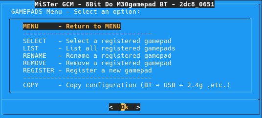
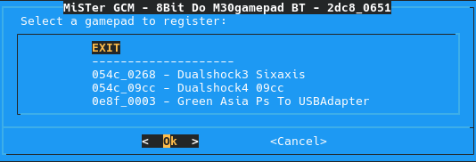
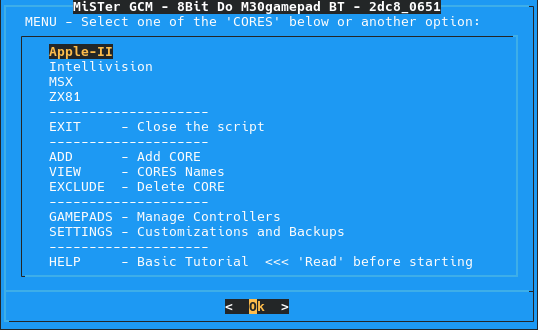
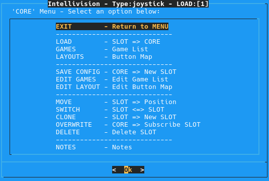
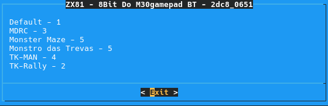
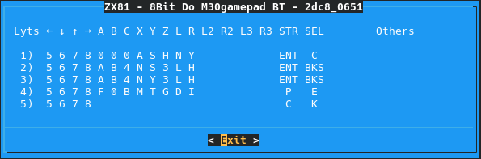
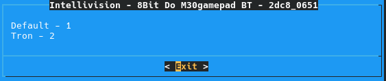
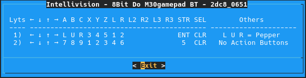
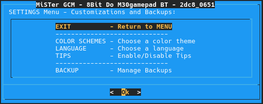
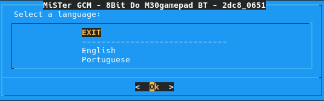
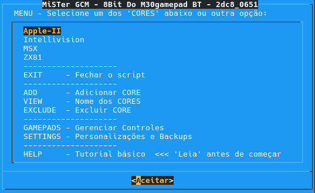
