════════════════════════════════════════════════  
MiSTer - Gamepad Config Manager (GCM)  
════════════════════════════════════════════════  
  
Manage, save and load multiple gamepad/controller configurations per  
'MiSTer FPGA' 'CORE'.  
  
Installation  
────────────  
  
To install the script, simply copy it to the 'Scripts' folder of your  
'MiSTer FPGA'.  
  
To run it, access the Scripts menu and click on 'gamepad_config_manager'.  
  
In this tutorial, when we refer to the folder '/media/fat/config/inputs'  
or 'smb://IP/sdcard/config/inputs', we will simply use 'config/inputs'.  
  
On the first run, the 'gcm' directory will be created inside the  
'config/inputs' folder.  
  
All files required for the script to function will be placed in this  
folder and will be created automatically on the first run and during  
the use of the script.  
  
How to use  
──────────  
  
═════════════════════════════════════════════════════════════════════════  
GCM - Gamepad Config Manager  
@MM 2026.04.23  
═════════════════════════════════════════════════════════════════════════  
  
Script for managing gamepad configurations on 'MiSTer FPGA'.  
  
Configurations are saved in SLOTS that can be loaded later,  
allowing multiple configurations per gamepad and CORE.  
  
The script is mainly used via gamepad.  
  
The keyboard is required only for editing and configuration tasks  
(explained in this HELP).  
  
Gamepad refers to any controller (joystick, gamepad, etc.) connected to  
the MiSTer.  
  
HELP file location: config/inputs/gcm/data/HELP_en.txt  
  
═════════════════════════════════════════════════════════════════════════  
INDEX  
═════════════════════════════════════════════════════════════════════════  
  
1\) MiSTer Files  
2\) The GCM Script  
3\) Script Usage Guide  
4\) Script Functions  
5\) Quick Guide  
6\) Important Information  
  
═════════════════════════════════════════════════════════════════════════  
1\) MiSTer Files  
═════════════════════════════════════════════════════════════════════════  
  
On MiSTer, gamepad configuration files are located in the 'config/inputs'  
folder.  
  
When a gamepad is connected via USB, Bluetooth, or 2.4G and configured, a  
file isgenerated.  
  
This file uses the prefix 'input' followed by a unique gamepad identifier  
(example: 1234_abcd), the suffix 'v3' for configurations made in the  
'Define joystick buttons' menu, or 'jk' if made in the 'Button/Key remap'  
menu, and the '.map' extension.  
  
Examples:  
  
  1. input_1234_abcd_v3.map  
  2. Intellivision_input_1234_abcd_v3.map  
  3. MSX_input_123_abcd_jk.map  
  
File 1  
─────────  
  
Configuration made in MiSTer 'Define joystick buttons':  
  
  input     - file prefix  
  1234_abcd - gamepad ID (hexadecimal)  
  v3        - joystick button definition  
  .map      - extension  
  
File 2  
─────────  
  
Configuration made in CORE menu 'Intellivision' in 'Define Intellivision  
buttons':  
  
  The only difference is the CORE name 'Intellivision', which appears as  
  prefix, followed by 'input_1234_abcd_v3.map'.  
  
  The suffix 'v3' indicates a 'joystick button definition' for the CORE  
  'Intellivision'.  
  
File 3  
─────────  
  
Configuration made in CORE menu 'MSX' in 'Button/Key remap':  
  
  In this case, the prefix will be 'MSX' and the suffix will be 'jk',  
  indicating a 'button/key remap' for the CORE 'MSX'.  
  
═════════════════════════════════════════════════════════════════════════  
2\) The GCM Script  
═════════════════════════════════════════════════════════════════════════  
  
The MiSTer saves only one gamepad configuration per CORE.  
  
The GCM script allows these configurations to be saved in numbered SLOTS,  
which can be loaded later.  
  
Each registered gamepad can have multiple associated CORES, with  
different configurations.  
  
It works like a 'SAVE STATE' of the gamepad, allowing it to include the  
'joystick button definition (v3)' and/or the 'button/key mapping (jk)'  
for the selected CORE, all handled automatically by the script.  
  
═════════════════════════════════════════════════════════════════════════  
3\) Script Usage Guide  
═════════════════════════════════════════════════════════════════════════  
  
Before anything, you must configure at least one gamepad in MiSTer and in  
the desired CORE.  
  
This configuration in the MiSTer CORE menu can be done in 'Define  
'CoreName' buttons' and/or 'Button/Key remap'.  
  
In the following example, we assume the gamepad has been configured in  
MiSTer and also in the Intellivision CORE.  
  
STEPS  
──────  
  
1. Configure the gamepad in MiSTer in 'Define joystick buttons'.  
  
2. Still in MiSTer, configure this same gamepad in the CORE menu. For  
example, for 'Intellivision', click 'Define Intellivision buttons'.  
  
3. Open this GCM script.  
  
4. In the script, click 'MANAGE(GAMEPADS)' and 'REGISTER'. Register the  
gamepad.  
  
5. In the main MENU, click 'ADD - ADD CORE'. Select the CORE name, in  
this case, 'Intellivision'.  
  
6. After adding the CORE to the MENU, click on CORES and select '  
Intellivision'.  
  
7. In the 'CORE MENU', click 'SAVE CONFIG - CORE ==> NEW SLOT'.  
  
  The current configuration for gamepad 1234_abcd in the  
  'Intellivision CORE' will be saved to SLOT 1. In this case, the  
  configuration identified by the script was only the 'joystick button  
  definition (v3)' and it will be identified by the letter J.  
  
  Each SLOT includes two additional files that can be edited for  
  identification purposes. Editing is optional.  
  
  a) The first is 'LAYOUTS - button map', where you can define the  
    relation between gamepad buttons and CORE controls.  
  
    The first line can be edited using the button configuration, while  
    the second line serves as a default reference.  
  
    INFO: 'The Intellivision controller also includes a numeric keypad,  
          in addition to the directional pad and action buttons.'  
  
  Example screen 'LAYOUTS - [EDIT] BUTTON MAP (SLOT 1)':  
`┌────────────────────────────────────────────────────────────────┐`  
`│                                                                │`  
`│ ← ↓ ↑ → L U R 3 4 5 1  2           ENT CLR    A B C = Action   │`  
`│ ← ↓ ↑ → A B C X Y Z L1 R1 L2 R2 Z2 STR SEL |----- OTHERS -----|│`  
`│                                                                │`  
`└────────────────────────────────────────────────────────────────┘`  
  
  b) The second is 'GAMES - game list', where you can edit the games  
    associated with SLOT 1.  
  
    Each game name must be on a separate line.  
  
  Example screen 'GAMES - [EDIT] GAME LIST (SLOT 1)':  
`┌───────────────────────────────────────────────────────────────┐`  
`│                                                               │`  
`│ Burgertime                                                    │`  
`│ Bump'n'Jump                                                   │`  
`│                                                               │`  
`└───────────────────────────────────────────────────────────────┘`  
  
8. Afterwards, in MiSTer, you can reconfigure the gamepad for another  
game that requires different button settings.  
  
  Just repeat STEP 7, and the new configuration will be saved in a new  
  SLOT.  
  
  You can view 'button maps' and 'game lists' in the 'LAYOUTS' and  
  'GAMES' menus.  
  
  Example with 3 SLOTS for 'Intellivision':  
  
  a) 'MENU' / 'LAYOUTS'  
  
  Example screen 'LAYOUTS - [VIEW] BUTTON MAP':  
`┌───────────────────────────────────────────────────────────────────────┐`  
`│                                                                       │`  
`│  SLOT  ← ↓ ↑ → A B C X Y Z L1 R1 L2 R2 Z2 STR SEL        OTHERS       │`  
`│  ----  ------------------------------------------ --------------------│`  
`│J   1)  ← ↓ ↑ → L U R 3 4 5 1  2           ENT CLR    A B C = Action   │`  
`│J   2)  ← ↓ ↑ → 7 8 9 1 2 3 4  6            5  CLR  No Action Buttons  │`  
`│J   3)  ← ↓ ↑ → U 0 R 4 5 6 7  9            1   3      A C = Action    │`  
`│                                                                       │`  
`└───────────────────────────────────────────────────────────────────────┘`  
  
  Note that the letter J indicates that the SLOT configuration refers to  
  'joystick button definitions' for each game.  
  
  b) 'MENU' / 'GAMES'  
  
  Example screen 'GAMES - [VIEW] GAME LIST':  
`┌───────────────────────────────────────────────────────────────┐`  
`│                                                               │`  
`│ Atlantis - 3                                                  │`  
`│ Bump'n'Jump - 1                                               │`  
`│ Burgertime - 1                                                │`  
`│ Tron - 2                                                      │`  
`│                                                               │`  
`└───────────────────────────────────────────────────────────────┘`  
  
  This list is sorted alphabetically by game name.  
  
  Note that the 'button map' and 'game list' indicate the SLOT, making  
  the next step easier.  
  
  Note: The example uses the Intellivision CORE, but the same procedure  
  can be used for any other CORE.  
  
  Another example:  
  
  CORE Apple-II - 'Button/Key remap' - Games Lode Runner and Karateka  
  
  a) 'MENU' / 'LAYOUTS'  
  
  Example screen 'LAYOUTS - [VIEW] BUTTON MAP':  
`┌───────────────────────────────────────────────────────────────────────┐`  
`│                                                                       │`  
`│  SLOT  ← ↓ ↑ → A B C X Y Z L1 R1 L2 R2 Z2 STR SEL        OTHERS       │`  
`│  ----  ------------------------------------------ --------------------│`  
`│R   1)  J K I L U O                        CTL        CTL+k=keyboard   │`  
`│A   2)  ← ↓ ↑ → X S W Z A S B  SP          ENT     DPAD=arrows SP=space│`  
`│                                                                       │`  
`└───────────────────────────────────────────────────────────────────────┘`  
  
  Note that the letter R indicates that SLOT 1 contains a 'button/key  
  remap' configuration for game Lode Runner.  
  
  The second SLOT is identified by letter A, meaning it contains both  
  'joystick button definition' and 'button/key remap' for game Karateka.  
  
  This classification J, R or A is used throughout SAVE operations.  
  
  You can remember them like this:  
    - J = Joystick/Gamepad  
    - R = Button/Key Remap  
    - A = Both  
  
  b) 'MENU' / 'GAMES'  
  
  Example screen 'GAMES - [VIEW] GAME LIST':  
`┌───────────────────────────────────────────────────────────────┐`  
`│                                                               │`  
`│ Karateka - 2                                                  │`  
`│ Lode Runner - 1                                               │`  
`│                                                               │`  
`└───────────────────────────────────────────────────────────────┘`  
  
9. 'MENU' / 'LOAD': Click 'LOAD - SLOT => CORE' and select a SLOT to load  
the saved configuration and overwrite the CORE configuration.  
  
  The only files modified in MiSTer are the 'v3' and/or 'jk' files of  
  the CORE, which will be replaced when LOAD is executed.  
  
   * If the SLOT is identified as J:  
       files replaced:  
         'CORE_input_ID_v3.map'  
  
         Example:  
  
           Intellivision_input_1234_abcd_v3.map  
  
   * If R (Remap):  
       files replaced:  
         'CORE_input_ID_jk.map'  
  
         Example:  
  
           ZX81_input_1234_abcd_jk.map  
  
   * If A (Both):  
       files replaced:  
         'CORE_input_ID_v3.map' and 'CORE_input_ID_jk.map'  
  
         Example:  
  
           MSX_input_1234_abcd_v3.map e MSX_input_1234_abcd_jk.map  
  
═════════════════════════════════════════════════════════════════════════  
4\) Script Functions  
═════════════════════════════════════════════════════════════════════════  
  
The script includes the following functions:  
  
  - Manage GAMEPADS:  
    GAMEPADS (select registered gamepad)  
    MANAGE:  
      LIST, RENAME, DELETE, EDIT TAG, REGISTER, CLONE  
  
  - Manage CORES:  
    CORES (select previously added CORE -> open CORE MENU)  
    ADD, VIEW, RENAME, DELETE  
  
  - Manage SLOTS in selected CORE (CORE MENU):  
    LOAD, LAYOUTS, GAMES  
    SAVE CONFIG, EDIT LAYOUT, EDIT GAMES  
    MOVE, SWITCH, DELETE  
    NOTES (add notes for gamepad/CORE)  
  
  - Customizations, Settings, and Backup:  
    SETTINGS:  
      COLOR SCHEMES, LANGUAGE, TIPS  
      RESET  
      BACKUP:  
        SAVE, RESTORE, DELETE  
      UNINSTALL  
  
═════════════════════════════════════════════════════════════════════════  
5\) Quick Guide  
═════════════════════════════════════════════════════════════════════════  
  
Here is a quick guide of the main functions.  
  
First, configure the gamepad in MiSTer and in the desired CORE.  
  
These are the main functions in the MENU, executed in order:  
  
  1. 'MANAGE / REGISTER': Register a new gamepad.  
  2. 'ADD': Add a CORE to a registered gamepad.  
  3. 'CORES': Select the desired CORE.  
  4. 'SAVE CONFIG': Save the 'gamepad/CORE' configuration to a SLOT.  
  (example: SLOT 1)  
  
   You can create another configuration for the same gamepad in the CORE  
   menu under 'Define CoreName buttons' and/or 'Button/Key remap', and  
   repeat steps 1–4, saving the configuration to a different SLOT.  
   (example: SLOT 2)  
  
  5. 'LOAD': Load SLOT and overwrite CORE configuration.  
  
Optional but useful functions:  
  
  6. 'EDIT LAYOUT' and 'EDIT GAMES': Edit visual SLOT representations  
  (keyboard  required).  
  7. 'LAYOUTS' and 'GAMES': View visual indicators.  
  
With these functions you already have everything needed to use the  
script.  
  
TIP: After everything is configured, the script can be fully used with  
the gamepad using MiSTer 'Select' and 'Back' buttons to access LOAD,  
LAYOUTS, and GAMES menus.  
  
═════════════════════════════════════════════════════════════════════════  
6\) Important Information  
═════════════════════════════════════════════════════════════════════════  
  
I. GCM Folder  
  
- The script stores all configuration inside:  
  'config/inputs/gcm'.  
  
- Inside this folder, you will find:  
  
  * 'config' folder      - script configuration files  
  * 'data' folder        - language files  
  * 'tmp' folder         - temporary script files  
  * 'gamepads' folder    - contains the folders of registered gamepads:  
    example: '1234_abcd' - the name is the gamepad ID  
  
    * Inside each registered gamepad folder, we have the folders for the  
      'CORES':  
  
      MSX, Intellivision, Apple-II, etc.  
  
      Examples of full paths:  
  
      config/inputs/gcm/gamepads/1234_abcd/MSX  
      config/inputs/gcm/gamepads/1234_abcd/Intellivision  
      config/inputs/gcm/gamepads/1234_abcd/Apple-II  
  
II. ADD Menu - Add CORES  
  
- The GCM script searches for previously configured CORES. Any CORE with  
  a valid configuration can be added and will then appear in the ADD  
  menu.  
  
III. Backup  
  
Backup File Types  
──────────────────────────  
  
- Backup .zip files have the following names:  
    Backup-GCM-MiSTer-26_04_10-12_30.zip  
    Backup-GCM-MiSTer-full-26_04_10-12_35.zip  
  
- The prefix 'Backup-GCM-MiSTer' identifies the GCM backup file.  
  
- Backups with 'full' in the name also include the .map files from the  
  MiSTer 'config/inputs' folder.  
  
- Backups are created in 'config/inputs/gcm'. They can be moved to a  
  computer or copied back into the same folder.  
  
- All backup files in 'config/inputs/gcm' can be restored.  
  
- Restoring the 'config/inputs/gcm' folder is not incremental. It  
contains a complete copy of all script files.  
  
- Restoring .map files from 'config/inputs' (in a 'full' backup) will  
  overwrite only the files present in both the folder and the backup.  
  Other files are not deleted or modified.  
  
- Backups do not include .zip files from other backups.  
  
Backup of GCM Script Files  
──────────────────────────  
  
Example: Backup-GCM-MiSTer-26_04_10-12_30.zip  
  
- The 'SAVE' and 'RESTORE' options in the 'BACKUP' menu allow saving  
  and restoring '/config/inputs/gcm', which contains GAMEPAD, CORE, and  
  SLOT configurations used by the script.  
  
- Note: .map files from 'config/inputs' are not included.  
  
- After restoring a backup, make sure that the joystick (.v3) and/or  
  remap (.jk) files are properly configured in MiSTer if they do not  
  already exist:  
  
    1. Go to 'Define joystick buttons' in MiSTer and configure the  
    gamepad.  
  
    2. In the CORE menu, configure the joystick buttons (Define CoreName  
    buttons) and keyboard remapping (Button/Key remap) if necessary.  
  
- To copy GCM backups, use FTP or Samba to access 'config/inputs'. You  
  can transfer them between the MiSTer and your PC.  
  
Backup FULL  
──────────────────────────  
  
Example: Backup-GCM-MiSTer-full-26_04_10-12_35.zip  
  
- Includes script files + .map files with control configurations.  
  
- Restoring a **'full' backup** will overwrite the current MiSTer  
  configurations if they are present.  
  
Restore on fresh MiSTer install  
──────────────────────────  
  
- On first execution, if a backup is found in 'config/inputs', it can  
  be automatically restored with confirmation.  
  
- Warning! Place only one backup file in 'config/inputs'.  
  
- If the file is a 'full' backup, MiSTer system files will also be  
  restored.  
  
- On first execution, the backup file will always be moved to  
  'config/inputs/gcm' regardless of whether restoration is confirmed.  
  
IV. Uninstallation  
  
- To uninstall, use the UNINSTALL menu or delete 'config/inputs/gcm' and  
  the 'gamepad_config_manager.sh' script from the 'Scripts' folder.  
  
  
--- END ---  
  
  
                ## Tutorial  
  
          I) First Initialization  
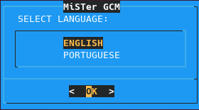  
   
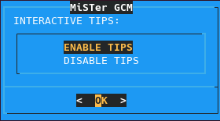  
   
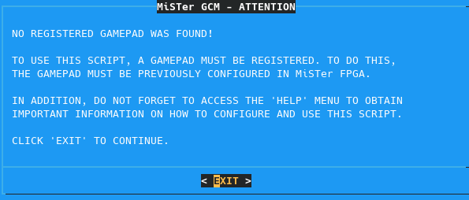  
   
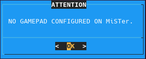  
   
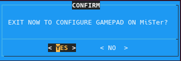  
   
  
           II) Register gamepad  
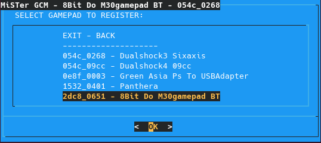  
   
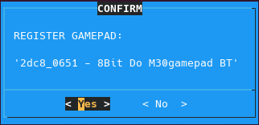  
   
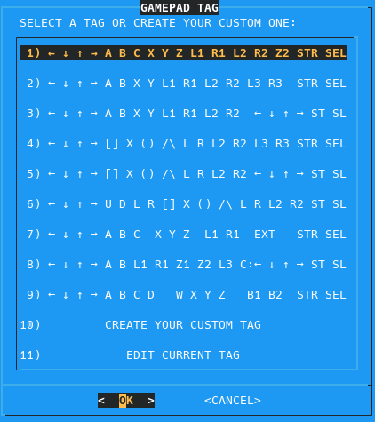  
   
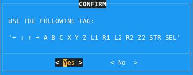  
   
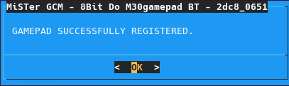  
   
  
                 III) HELP  
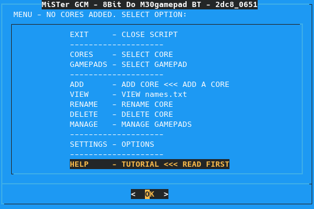  
   
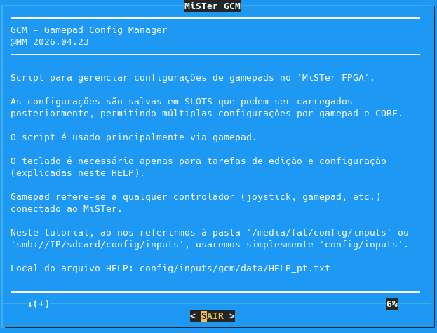  
   
  
               IV) Add CORE  
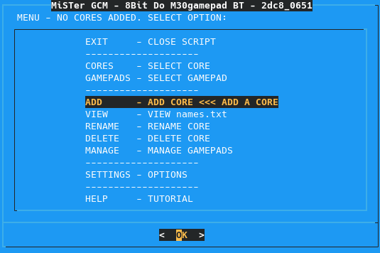  
   
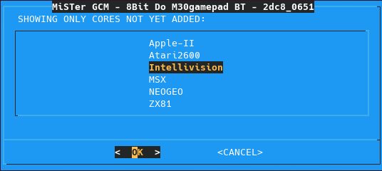  
   
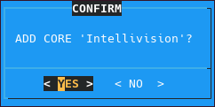  
   
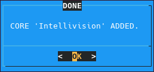  
   
  
     V) Open CORE, SAVE and EDIT  
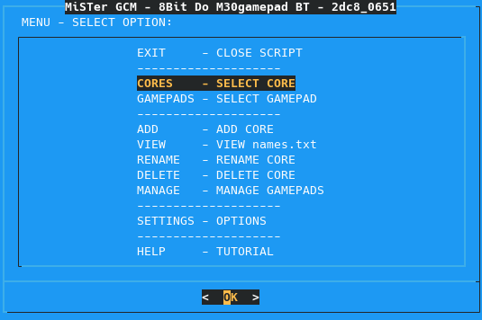  
   
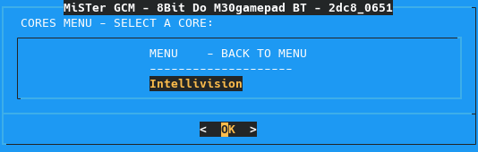  
   
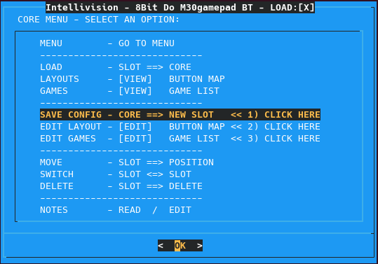  
   
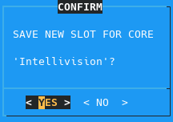  
   
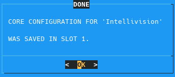  
   
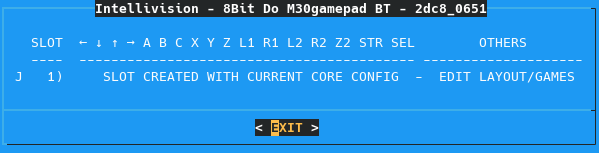  
   
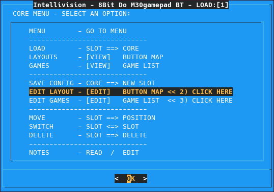  
   
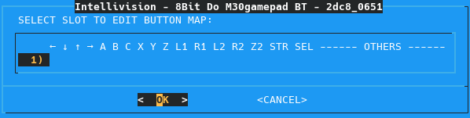  
   
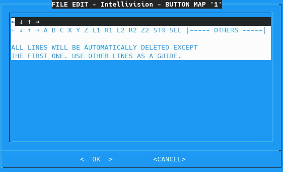  
   
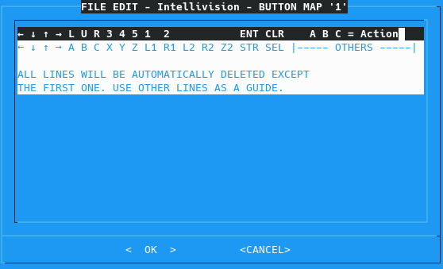  
   
  
   
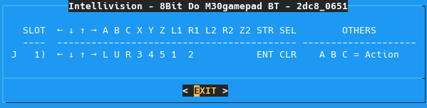  
   
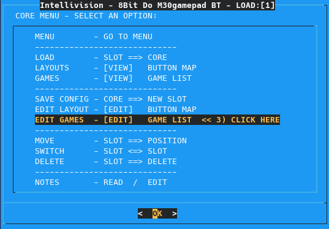  
   
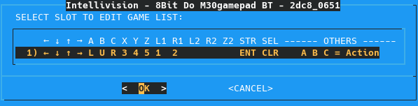  
   
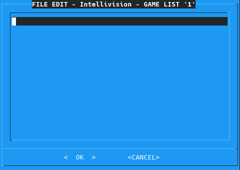  
   
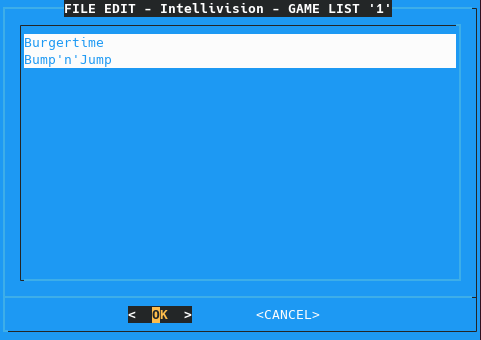  
   
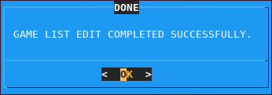  
   
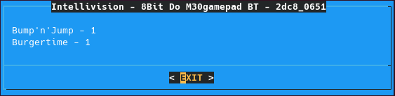  
   
  
         VI) View LAYOUTS and GAMES  
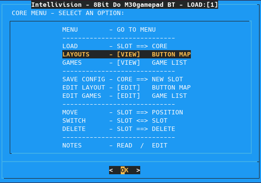  
   
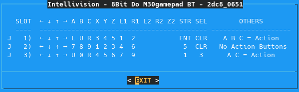  
   
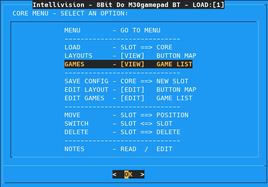  
   
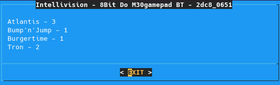  
   
  
          VII) LOAD SLOT => MiSTer  
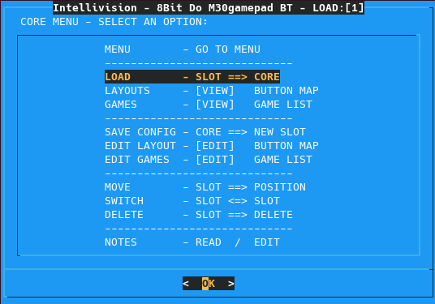  
   
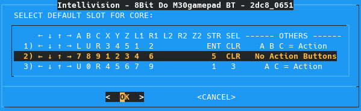  
   
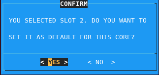  
   
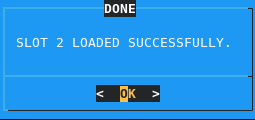  
   
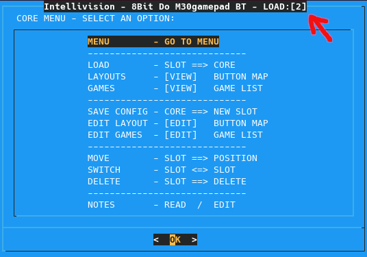  
   
  
              VIII) GAMEPADS  
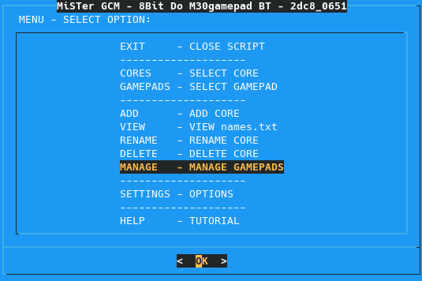  
   
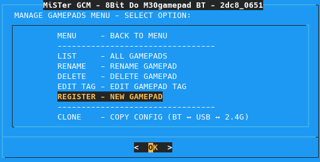  
   
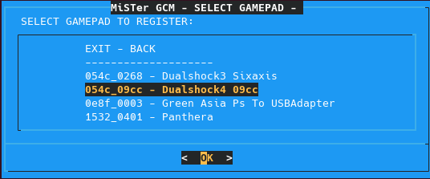  
   
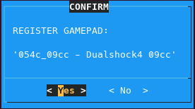  
   
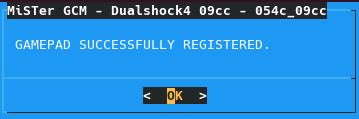  
   
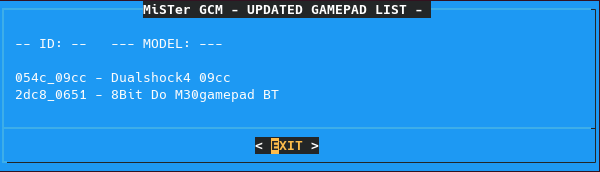  
   
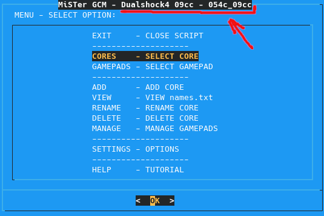  
   
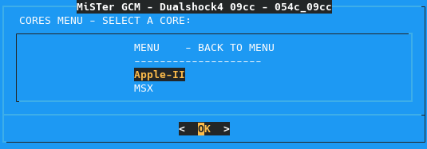  
   
  
   
  
   
  
          IX) RENAME CORE and GAMEPAD  
  
   
  
   
  
   
  
   
  
   
  
   
  
   
  
   
  
   
  
   
  
            X) SELECT GAMEPAD  
  
   
  
   
  
   
  
              XI) SETTINGS  
  
   
  
   
  
   
  
   
  
   
  
   
  
   
  
   
  
   
  
               XII) BACKUPS  
  
   
  
   
  
   
  
   
  
   
  
   
  
   
  
          XIII) Uninstallation  
  
   
  
   
  
   
  
   
  
   
  
    XIV) First initialization with BACKUP  
  
   
  
   
  
   
  
   
  
   
  
   
  
          XV) GAMEPADS - EDIT TAG  
  
   
  
   
  
   
  
   
  
   
  
   
  
   
  
   
  
   
  
   
  
   
  
   
  
   
